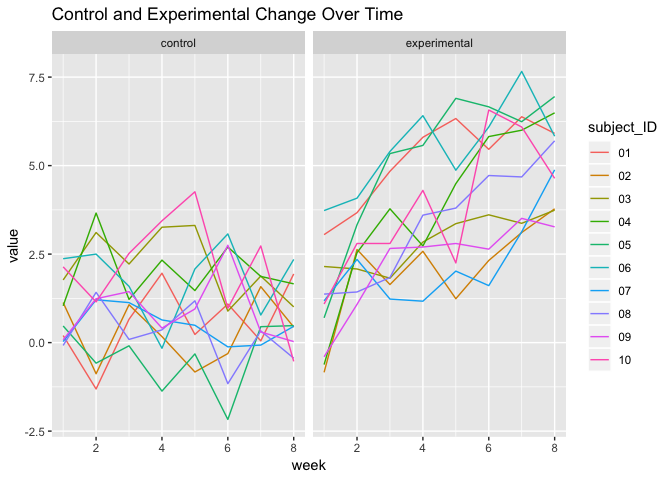

Homework 5
================
Laura Cosgrove
11/3/2018

Problem 1
---------

Create a tidy dataframe containing data from all participants, including the subject ID, arm, and observations over time:

Start with a dataframe containing all file names; the list.files function will help Iterate over file names and read in data for each subject using purrr::map and saving the result as a new variable in the dataframe Tidy the result; manipulate file names to include control arm and subject ID, make sure weekly observations are “tidy”, and do any other tidying that’s necessary Make a spaghetti plot showing observations on each subject over time, and comment on differences between groups.

``` r
library(tidyverse)
```

    ## ── Attaching packages ────────────────────────────────────────────────────────────────────────────────────────── tidyverse 1.2.1 ──

    ## ✔ ggplot2 3.0.0     ✔ purrr   0.2.5
    ## ✔ tibble  1.4.2     ✔ dplyr   0.7.6
    ## ✔ tidyr   0.8.1     ✔ stringr 1.3.1
    ## ✔ readr   1.1.1     ✔ forcats 0.3.0

    ## ── Conflicts ───────────────────────────────────────────────────────────────────────────────────────────── tidyverse_conflicts() ──
    ## ✖ dplyr::filter() masks stats::filter()
    ## ✖ dplyr::lag()    masks stats::lag()

``` r
directory_base <- "./data/"
study_data <- tibble(files = str_c(directory_base, list.files("./data")))

study_data <- study_data %>% 
  mutate(subject_data = map(study_data$files, read_csv)) %>% 
  unnest() %>% 
  mutate(files = str_replace(files, "./data/", "")) %>% 
  mutate(files = str_replace(files, ".csv", "")) %>% 
  mutate(group = str_detect(files, "con")) %>% 
  mutate(group = ifelse(group == TRUE, "control", "experimental")) %>% 
  mutate(files = as.factor(str_replace(files, "^..._", ""))) %>% 
  rename(subject_ID = files) %>%
  gather(key = week, value = value, starts_with("week")) %>% 
  mutate(week = as.numeric(str_replace(week, "week_", "")))
```

    ## Parsed with column specification:
    ## cols(
    ##   week_1 = col_double(),
    ##   week_2 = col_double(),
    ##   week_3 = col_double(),
    ##   week_4 = col_double(),
    ##   week_5 = col_double(),
    ##   week_6 = col_double(),
    ##   week_7 = col_double(),
    ##   week_8 = col_double()
    ## )
    ## Parsed with column specification:
    ## cols(
    ##   week_1 = col_double(),
    ##   week_2 = col_double(),
    ##   week_3 = col_double(),
    ##   week_4 = col_double(),
    ##   week_5 = col_double(),
    ##   week_6 = col_double(),
    ##   week_7 = col_double(),
    ##   week_8 = col_double()
    ## )
    ## Parsed with column specification:
    ## cols(
    ##   week_1 = col_double(),
    ##   week_2 = col_double(),
    ##   week_3 = col_double(),
    ##   week_4 = col_double(),
    ##   week_5 = col_double(),
    ##   week_6 = col_double(),
    ##   week_7 = col_double(),
    ##   week_8 = col_double()
    ## )
    ## Parsed with column specification:
    ## cols(
    ##   week_1 = col_double(),
    ##   week_2 = col_double(),
    ##   week_3 = col_double(),
    ##   week_4 = col_double(),
    ##   week_5 = col_double(),
    ##   week_6 = col_double(),
    ##   week_7 = col_double(),
    ##   week_8 = col_double()
    ## )
    ## Parsed with column specification:
    ## cols(
    ##   week_1 = col_double(),
    ##   week_2 = col_double(),
    ##   week_3 = col_double(),
    ##   week_4 = col_double(),
    ##   week_5 = col_double(),
    ##   week_6 = col_double(),
    ##   week_7 = col_double(),
    ##   week_8 = col_double()
    ## )
    ## Parsed with column specification:
    ## cols(
    ##   week_1 = col_double(),
    ##   week_2 = col_double(),
    ##   week_3 = col_double(),
    ##   week_4 = col_double(),
    ##   week_5 = col_double(),
    ##   week_6 = col_double(),
    ##   week_7 = col_double(),
    ##   week_8 = col_double()
    ## )
    ## Parsed with column specification:
    ## cols(
    ##   week_1 = col_double(),
    ##   week_2 = col_double(),
    ##   week_3 = col_double(),
    ##   week_4 = col_double(),
    ##   week_5 = col_double(),
    ##   week_6 = col_double(),
    ##   week_7 = col_double(),
    ##   week_8 = col_double()
    ## )
    ## Parsed with column specification:
    ## cols(
    ##   week_1 = col_double(),
    ##   week_2 = col_double(),
    ##   week_3 = col_double(),
    ##   week_4 = col_double(),
    ##   week_5 = col_double(),
    ##   week_6 = col_double(),
    ##   week_7 = col_double(),
    ##   week_8 = col_double()
    ## )
    ## Parsed with column specification:
    ## cols(
    ##   week_1 = col_double(),
    ##   week_2 = col_double(),
    ##   week_3 = col_double(),
    ##   week_4 = col_double(),
    ##   week_5 = col_double(),
    ##   week_6 = col_double(),
    ##   week_7 = col_double(),
    ##   week_8 = col_double()
    ## )
    ## Parsed with column specification:
    ## cols(
    ##   week_1 = col_double(),
    ##   week_2 = col_double(),
    ##   week_3 = col_double(),
    ##   week_4 = col_double(),
    ##   week_5 = col_double(),
    ##   week_6 = col_double(),
    ##   week_7 = col_double(),
    ##   week_8 = col_double()
    ## )
    ## Parsed with column specification:
    ## cols(
    ##   week_1 = col_double(),
    ##   week_2 = col_double(),
    ##   week_3 = col_double(),
    ##   week_4 = col_double(),
    ##   week_5 = col_double(),
    ##   week_6 = col_double(),
    ##   week_7 = col_double(),
    ##   week_8 = col_double()
    ## )
    ## Parsed with column specification:
    ## cols(
    ##   week_1 = col_double(),
    ##   week_2 = col_double(),
    ##   week_3 = col_double(),
    ##   week_4 = col_double(),
    ##   week_5 = col_double(),
    ##   week_6 = col_double(),
    ##   week_7 = col_double(),
    ##   week_8 = col_double()
    ## )
    ## Parsed with column specification:
    ## cols(
    ##   week_1 = col_double(),
    ##   week_2 = col_double(),
    ##   week_3 = col_double(),
    ##   week_4 = col_double(),
    ##   week_5 = col_double(),
    ##   week_6 = col_double(),
    ##   week_7 = col_double(),
    ##   week_8 = col_double()
    ## )

    ## Parsed with column specification:
    ## cols(
    ##   week_1 = col_double(),
    ##   week_2 = col_double(),
    ##   week_3 = col_double(),
    ##   week_4 = col_double(),
    ##   week_5 = col_double(),
    ##   week_6 = col_double(),
    ##   week_7 = col_integer(),
    ##   week_8 = col_double()
    ## )

    ## Parsed with column specification:
    ## cols(
    ##   week_1 = col_double(),
    ##   week_2 = col_double(),
    ##   week_3 = col_double(),
    ##   week_4 = col_double(),
    ##   week_5 = col_double(),
    ##   week_6 = col_double(),
    ##   week_7 = col_double(),
    ##   week_8 = col_double()
    ## )
    ## Parsed with column specification:
    ## cols(
    ##   week_1 = col_double(),
    ##   week_2 = col_double(),
    ##   week_3 = col_double(),
    ##   week_4 = col_double(),
    ##   week_5 = col_double(),
    ##   week_6 = col_double(),
    ##   week_7 = col_double(),
    ##   week_8 = col_double()
    ## )
    ## Parsed with column specification:
    ## cols(
    ##   week_1 = col_double(),
    ##   week_2 = col_double(),
    ##   week_3 = col_double(),
    ##   week_4 = col_double(),
    ##   week_5 = col_double(),
    ##   week_6 = col_double(),
    ##   week_7 = col_double(),
    ##   week_8 = col_double()
    ## )
    ## Parsed with column specification:
    ## cols(
    ##   week_1 = col_double(),
    ##   week_2 = col_double(),
    ##   week_3 = col_double(),
    ##   week_4 = col_double(),
    ##   week_5 = col_double(),
    ##   week_6 = col_double(),
    ##   week_7 = col_double(),
    ##   week_8 = col_double()
    ## )
    ## Parsed with column specification:
    ## cols(
    ##   week_1 = col_double(),
    ##   week_2 = col_double(),
    ##   week_3 = col_double(),
    ##   week_4 = col_double(),
    ##   week_5 = col_double(),
    ##   week_6 = col_double(),
    ##   week_7 = col_double(),
    ##   week_8 = col_double()
    ## )
    ## Parsed with column specification:
    ## cols(
    ##   week_1 = col_double(),
    ##   week_2 = col_double(),
    ##   week_3 = col_double(),
    ##   week_4 = col_double(),
    ##   week_5 = col_double(),
    ##   week_6 = col_double(),
    ##   week_7 = col_double(),
    ##   week_8 = col_double()
    ## )

``` r
study_data %>% 
  ggplot(aes(x = week, y = value, color = subject_ID)) +
  geom_line() +
  facet_grid(~group) +
  labs(
    title = "Control and Experimental Change Over Time"
  )
```



The experimental group shows a general trend of increase over time, while the control group's trend is largely static.

Problem 2
---------

``` r
homicide_data <- read_csv("https://raw.githubusercontent.com/washingtonpost/data-homicides/master/homicide-data.csv")
```

    ## Parsed with column specification:
    ## cols(
    ##   uid = col_character(),
    ##   reported_date = col_integer(),
    ##   victim_last = col_character(),
    ##   victim_first = col_character(),
    ##   victim_race = col_character(),
    ##   victim_age = col_character(),
    ##   victim_sex = col_character(),
    ##   city = col_character(),
    ##   state = col_character(),
    ##   lat = col_double(),
    ##   lon = col_double(),
    ##   disposition = col_character()
    ## )

``` r
homicide_data %>% 
  mutate(year_reported = str_sub(reported_date, 1, 4)) %>% 
  distinct(year_reported) %>% 
  arrange(as.numeric(year_reported))
```

    ## # A tibble: 11 x 1
    ##    year_reported
    ##    <chr>        
    ##  1 2007         
    ##  2 2008         
    ##  3 2009         
    ##  4 2010         
    ##  5 2011         
    ##  6 2012         
    ##  7 2013         
    ##  8 2014         
    ##  9 2015         
    ## 10 2016         
    ## 11 2017

``` r
homicide_data %>% 
  distinct(disposition)
```

    ## # A tibble: 3 x 1
    ##   disposition          
    ##   <chr>                
    ## 1 Closed without arrest
    ## 2 Closed by arrest     
    ## 3 Open/No arrest

This dataset contains information about 52179 homicides in 50 U.S. cities in 28 states reported from 2007 to 2017. The victim's name, rage, age, and sex are reported for each homicide, as well as the status of the case (closed without arrest, closed by arrest, or open).

*Create a city\_state variable (e.g. “Baltimore, MD”) and then summarize within cities to obtain the total number of homicides and the number of unsolved homicides (those for which the disposition is “Closed without arrest” or “Open/No arrest”).*

``` r
prop_homicides <- homicide_data %>% 
  mutate(city_state = str_c(city, state, sep = ", ")) %>%
  select(city_state, disposition) %>% 
  group_by(city_state) %>%
  mutate(unsolved = ifelse(disposition == "Open/No arrest", 1, 0)) %>% 
  summarize(total = n(),
            unsolved = sum(unsolved))
```

For the city of Baltimore, MD, use the prop.test function to estimate the proportion of homicides that are unsolved; save the output of prop.test as an R object, apply the broom::tidy to this object and pull the estimated proportion and confidence intervals from the resulting tidy dataframe.

``` r
baltimore_data <- prop_homicides %>% 
  filter(city_state == "Baltimore, MD")

baltimore_proptest <- prop.test(baltimore_data$unsolved, baltimore_data$total) 

baltimore_proptest <- broom::tidy(baltimore_proptest)

baltimore_proptest %>% 
  pull(estimate)
```

    ## [1] 0.5917934

``` r
baltimore_proptest %>% 
  pull(conf.low)
```

    ## [1] 0.5733849

``` r
baltimore_proptest %>% 
  pull(conf.high)
```

    ## [1] 0.6099504

Now run prop.test for each of the cities in your dataset, and extract both the proportion of unsolved homicides and the confidence interval for each. Do this within a “tidy” pipeline, making use of purrr::map, purrr::map2, list columns and unnest as necessary to create a tidy dataframe with estimated proportions and CIs for each city.

``` r
prop_homicides <- nest(prop_homicides, total:unsolved) 

prop_test_homicides = function(df) {
  prop.test(x = df$unsolved, n = df$total)
}

prop_homicides <- prop_homicides %>% 
  mutate(prop_test = map(data, prop_test_homicides)) %>% 
  select(city_state, prop_test) %>% 
  mutate(prop_test = map(prop_test, broom::tidy)) %>% 
  unnest() %>% 
  select(city_state, estimate, conf.low, conf.high)
```

    ## Warning in prop.test(x = df$unsolved, n = df$total): Chi-squared
    ## approximation may be incorrect
