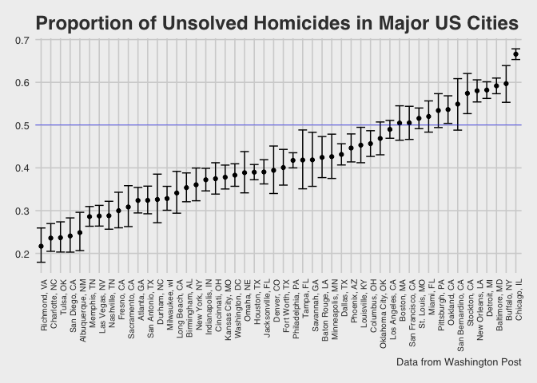

Homework 5
================
Laura Cosgrove
11/3/2018

Problem 1
---------

``` r
library(tidyverse)
```

    ## ── Attaching packages ────────────────────────────────────────────────────────────────────────────────────────── tidyverse 1.2.1 ──

    ## ✔ ggplot2 3.0.0     ✔ purrr   0.2.5
    ## ✔ tibble  1.4.2     ✔ dplyr   0.7.7
    ## ✔ tidyr   0.8.1     ✔ stringr 1.3.1
    ## ✔ readr   1.1.1     ✔ forcats 0.3.0

    ## ── Conflicts ───────────────────────────────────────────────────────────────────────────────────────────── tidyverse_conflicts() ──
    ## ✖ dplyr::filter() masks stats::filter()
    ## ✖ dplyr::lag()    masks stats::lag()

First, I'll create a tidy dataframe containing data from all participants, including the subject ID, arm, and observations over time, by reading in data from multiple files.

``` r
directory_base <- "./data/"
study_data <- tibble(files = str_c(directory_base, list.files("./data")))

#Reading data from multipe files and clean observation names

study_data <- study_data %>% 
  mutate(subject_data = map(study_data$files, read_csv)) %>% 
  unnest() %>% 
  mutate(files = str_replace(files, "./data/", "")) %>% 
  mutate(files = str_replace(files, ".csv", "")) %>% 
  mutate(group = str_detect(files, "con")) %>% 
  mutate(group = ifelse(group == TRUE, "control", "experimental")) %>% 
  mutate(files = as.factor(str_replace(files, "^..._", ""))) %>% 
  rename(subject_ID = files) %>%
  gather(key = week, value = value, starts_with("week")) %>% 
  mutate(week = as.numeric(str_replace(week, "week_", "")))

study_data %>% 
  ggplot(aes(x = week, y = value, color = subject_ID)) +
  geom_line() +
  facet_grid(~group) +
  labs(
    title = "Control and Experimental Change Over Time"
  )
```


The experimental group shows a general trend of increase over time, while the control group's trend is largely static. This dataset looks promising for further hypothesis testing analyses.

Problem 2
---------

The Washington Post gathered homicide data on large U.S. cities, and made the data public as part of their investigation. First, I'll load in the raw data and look at the years reported it covers as well as the outcomes it studies.

``` r
homicide_data <- read_csv("https://raw.githubusercontent.com/washingtonpost/data-homicides/master/homicide-data.csv")
```

    ## Parsed with column specification:
    ## cols(
    ##   uid = col_character(),
    ##   reported_date = col_integer(),
    ##   victim_last = col_character(),
    ##   victim_first = col_character(),
    ##   victim_race = col_character(),
    ##   victim_age = col_character(),
    ##   victim_sex = col_character(),
    ##   city = col_character(),
    ##   state = col_character(),
    ##   lat = col_double(),
    ##   lon = col_double(),
    ##   disposition = col_character()
    ## )

``` r
homicide_data %>% 
  mutate(year_reported = str_sub(reported_date, 1, 4)) %>% 
  distinct(year_reported) %>% 
  arrange(as.numeric(year_reported))
```

    ## # A tibble: 11 x 1
    ##    year_reported
    ##    <chr>        
    ##  1 2007         
    ##  2 2008         
    ##  3 2009         
    ##  4 2010         
    ##  5 2011         
    ##  6 2012         
    ##  7 2013         
    ##  8 2014         
    ##  9 2015         
    ## 10 2016         
    ## 11 2017

``` r
homicide_data %>% 
  distinct(disposition)
```

    ## # A tibble: 3 x 1
    ##   disposition          
    ##   <chr>                
    ## 1 Closed without arrest
    ## 2 Closed by arrest     
    ## 3 Open/No arrest

This dataset contains information about 52179 homicides in 50 U.S. cities in 28 states reported from 2007 to 2017. The victim's name, rage, age, and sex are reported for each homicide, as well as the status of the case (closed without arrest, closed by arrest, or open).

Next, I'll create a variable to look at the summary data within cities: the total number of homicides and the number of unsolved homicides (those for which the disposition is “Closed without arrest” or “Open/No arrest”).

``` r
prop_homicides <- homicide_data %>% 
  mutate(city_state = str_c(city, state, sep = ", ")) %>%
  select(city_state, disposition) %>% 
  group_by(city_state) %>%
  mutate(unsolved = ifelse(disposition == "Open/No arrest", 1, 0)) %>% 
  summarize(total = n(),
            unsolved = sum(unsolved))

prop_homicides %>% 
  knitr::kable()
```

| city\_state        |  total|  unsolved|
|:-------------------|------:|---------:|
| Albuquerque, NM    |    378|        94|
| Atlanta, GA        |    973|       315|
| Baltimore, MD      |   2827|      1673|
| Baton Rouge, LA    |    424|       180|
| Birmingham, AL     |    800|       283|
| Boston, MA         |    614|       310|
| Buffalo, NY        |    521|       311|
| Charlotte, NC      |    687|       162|
| Chicago, IL        |   5535|      3686|
| Cincinnati, OH     |    694|       260|
| Columbus, OH       |   1084|       495|
| Dallas, TX         |   1567|       676|
| Denver, CO         |    312|       123|
| Detroit, MI        |   2519|      1466|
| Durham, NC         |    276|        90|
| Fort Worth, TX     |    549|       220|
| Fresno, CA         |    487|       146|
| Houston, TX        |   2942|      1147|
| Indianapolis, IN   |   1322|       492|
| Jacksonville, FL   |   1168|       456|
| Kansas City, MO    |   1190|       450|
| Las Vegas, NV      |   1381|       397|
| Long Beach, CA     |    378|       129|
| Los Angeles, CA    |   2257|      1106|
| Louisville, KY     |    576|       261|
| Memphis, TN        |   1514|       433|
| Miami, FL          |    744|       387|
| Milwaukee, wI      |   1115|       366|
| Minneapolis, MN    |    366|       156|
| Nashville, TN      |    767|       221|
| New Orleans, LA    |   1434|       832|
| New York, NY       |    627|       226|
| Oakland, CA        |    947|       508|
| Oklahoma City, OK  |    672|       315|
| Omaha, NE          |    409|       159|
| Philadelphia, PA   |   3037|      1268|
| Phoenix, AZ        |    914|       408|
| Pittsburgh, PA     |    631|       337|
| Richmond, VA       |    429|        93|
| Sacramento, CA     |    376|       116|
| San Antonio, TX    |    833|       270|
| San Bernardino, CA |    275|       151|
| San Diego, CA      |    461|       111|
| San Francisco, CA  |    663|       335|
| Savannah, GA       |    246|       103|
| St. Louis, MO      |   1677|       865|
| Stockton, CA       |    444|       255|
| Tampa, FL          |    208|        87|
| Tulsa, AL          |      1|         0|
| Tulsa, OK          |    583|       138|
| Washington, DC     |   1345|       515|

Tulsa, AL seems to have some strange data: This might be a miscoding. I will explore:

``` r
prop_homicides %>% 
  filter(city_state == "Tulsa, AL")
```

    ## # A tibble: 1 x 3
    ##   city_state total unsolved
    ##   <chr>      <int>    <dbl>
    ## 1 Tulsa, AL      1        0

``` r
homicide_data %>% 
  filter(state == "AL" & city == "Tulsa")
```

    ## # A tibble: 1 x 12
    ##   uid   reported_date victim_last victim_first victim_race victim_age
    ##   <chr>         <int> <chr>       <chr>        <chr>       <chr>     
    ## 1 Tul-…      20160930 HARRIS      LESLIE       White       41        
    ## # ... with 6 more variables: victim_sex <chr>, city <chr>, state <chr>,
    ## #   lat <dbl>, lon <dbl>, disposition <chr>

Since there's only one entry, it's probably miscoded either for Tulsa, OK or Birmingham, AL. I'm not sure which, so I'll remove it for the final analyses below:

``` r
prop_homicides <- prop_homicides %>% 
  filter(city_state != "Tulsa, AL")
```

### Exploring Estimates for Proportions of Unsolved Murders

For Baltimore, MD, I will estimate the proportion of homicides that are unsolved using `prop.test`, save the output of prop.test as an R object, and apply `broom::tidy` to this object in order to pull the estimated proportion and confidence intervals from the resulting tidy dataframe.

``` r
baltimore_data <- prop_homicides %>% 
  filter(city_state == "Baltimore, MD")

baltimore_proptest <- prop.test(baltimore_data$unsolved, baltimore_data$total) 

baltimore_proptest <- broom::tidy(baltimore_proptest)

baltimore_proptest %>% 
  pull(estimate)
```

    ## [1] 0.5917934

``` r
baltimore_proptest %>% 
  pull(conf.low)
```

    ## [1] 0.5733849

``` r
baltimore_proptest %>% 
  pull(conf.high)
```

    ## [1] 0.6099504

Using this method as a framework, I'll create a function to run `prop.test` for each of the cities in my dataset, and I will extract both the proportion of unsolved homicides and the confidence interval for each and save that in the previous `prop_homicides` dataframe.

``` r
prop_homicides <- nest(prop_homicides, total:unsolved) 

prop_test_homicides = function(df) {
  prop.test(x = df$unsolved, n = df$total)
}

prop_homicides <- prop_homicides %>% 
  mutate(prop_test = map(data, prop_test_homicides)) %>% 
  select(city_state, prop_test) %>% 
  mutate(prop_test = map(prop_test, broom::tidy)) %>% 
  unnest() %>% 
  select(city_state, estimate, conf.low, conf.high)
```

Finally, I'll use a scatter plot with error bars to visualize the differences by city in the point estimates of the proportion and confidence intervals given by the proportion test.

``` r
prop_homicides %>% 
  mutate(city_state = factor(city_state)) %>% 
  mutate(city_state = forcats::fct_reorder(city_state, estimate)) %>% 
  ggplot(aes(x = city_state, y = estimate)) +
  geom_point() +
  geom_errorbar(aes(ymin = conf.low, ymax = conf.high)) +
  ggthemes::theme_fivethirtyeight() +
  theme(axis.text.x = element_text(angle = 90, hjust = 1, size = rel(0.8))) +
  geom_hline(yintercept = 0.50, color = "blue", size = 0.2) +
  labs(title = "Proportion of Unsolved Homicides in Major US Cities",
       caption = "Data from Washington Post")
```


